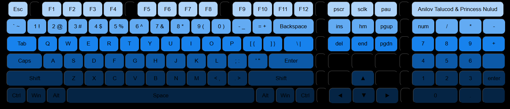
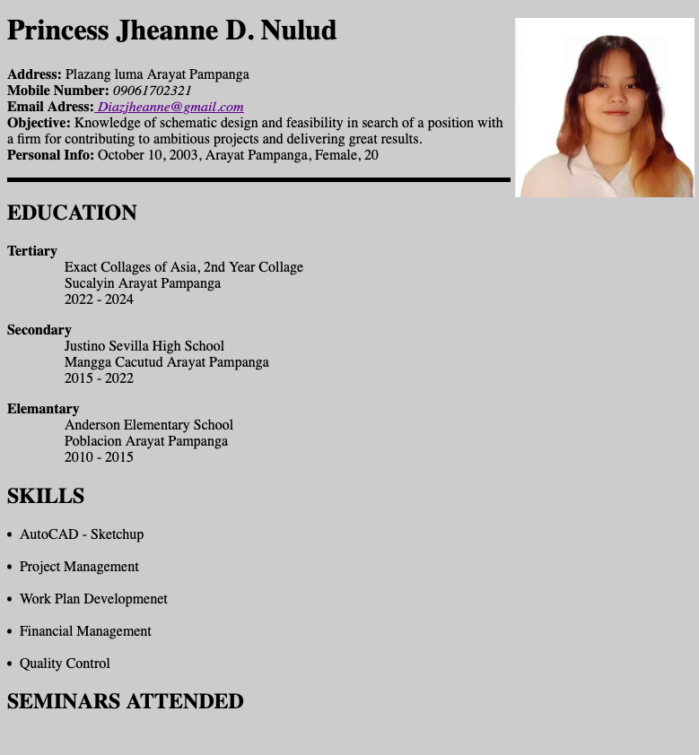

Princess Jheanne D. Nulud Portfolio

This repository contains the HTML, CSS, and assets for Princess Jheanne D. Nulud's personal portfolio website.

## Table of Contents
- [Intoduction](#Intoduction)
- [Features](#Features)
- [Contributing](#Contributing)
- [Getting Started](#Getting-Started)

## Introduction

This project showcases the portfolio of Princess Jheanne D. Nulud. It includes sections such as Home, About Me, Projects, and Contact. The website is designed to be responsive, ensuring an optimal viewing experience on various devices.

## Features

- Responsive Design: The website adjusts to different screen sizes using media queries with separate stylesheets for tablets and phones (tablet.css and phone.css).
- Navigation: A navigation bar allows easy access to different sections of the site.
- Social Media Integration: Links to Facebook, Discord, GitHub, and LinkedIn are provided.
- Download CV: A button to download Princess Jheanne D. Nulud's CV.
- About Me Section: Information about Princess Jheanne D. Nulud, highlighting interests in anime and gaming.
- Project Showcase: A section displaying various projects with images and titles.
- Contact Form: A form for visitors to send messages directly from the website.

## Contributing

To use this code, simply copy the HTML and CSS files into your project directory. Make sure to link the CSS files (style.css, tablet.css, phone.css) appropriately in the HTML file.


## Getting Started

To view the website, simply open the `index.html` file in your web browser.

### Prerequisites

Make sure you have a web browser installed (e.g., Chrome, Firefox).

### Installation

```bash
# Clone this repository
$  git clone https://github.com/AnilovTalucod/Portflio.git


# Navigate to the project directory:
    ```bash
    cd your-repo-name
    ```

# Open index.html in your web browser to view the portfolio.
```

<br/>
<br>

## Template Instructions:

## Step 1 - STYLES

Make sure you have started the CSS compilation by running

make sure the css is connected in html

<br/>

<br/>

## Step 2 - Homepage

Go to `index.html` and fill your information, there are 4 sections:

### Navigation Bar

- The navigation bar (<nav>) is an essential component of the portfolio website. It allows users to easily navigate between different sections of the site, enhancing the overall user experience.


```HTML Structure
 <!--Start Nav-->
    <nav class="navbar">
        <ul>
            <li><a href="#home">Home</a></li>
            <li><a href="#about">About Me</a></li>
            <li><a href="#project">Project</a></li>
            <li><a href="#contact">Contact Me</a></li>
        </ul>
    </nav>
    <!--End Nav-->
    ```
  ```
### Home Section

- The Home section (<section id="home">) serves as the introductory part of the portfolio website. It provides a brief introduction to Princess Jheanne D. Nulud and includes social media links, as well as a button to download her CV.

```HTML Structure
<!--Home Header-->
    <section id="home">
        <div class="main">
            <h1 class="headings">I'M <br> PRINCESS NULUD</h1>
            <marquee behavior="" direction=""><div class="social-icon">
                <a href="https://www.facebook.com/profile.php?id=61550034554147"></a>
                <a href="https://discord.com"></a>
                <a href="https://github.com/JheanneNulud"></a>
                <a href="https://www.linkedin.com/in/princess-jheanne-nulud-b85158311/"></a>
            </div></marquee>
            <button class="btn">
                Download CV
            </button>
        </div>
    </section>
<!-- End Home -->
```
``
### About Section Code
 
 - The About Me section (<section id="about">) serves as an introduction to Princess Jheanne D. Nulud. It provides personal insights, including her interests in anime and gaming, and includes an image.

 ```HTML Structure
 <!--Start About Section -->
   <section id="about">
        <h1 class="headings">ABOUT ME</h1>
        <div id="pic">
            
            <div id="intro">
                <h2>PRINCESS NULUD</h2>
                <p>Anime Aficionado <br>
                    I’m an avid anime watcher, captivated by the unique storytelling, dynamic characters, and stunning visuals. Whether it’s a classic series or the latest releases, I love diving into the diverse and imaginative universes that anime offers. Anime inspires my creativity and fuels my passion for art. <br>
                    Gaming Enthusiast <br>Playing games is one of my favorite pastimes. I enjoy exploring different genres, from action-packed adventures to intricate strategy games. Gaming offers me a chance to immerse myself in new worlds, face exciting challenges, and connect with a global community of fellow gamers. It’s my go-to way to unwind and have fun.</p>
            </div>
        </div>
    </section>
<!--End About Section -->
 ```
  ``
  ### Projects Section

  - The Project section (<section id="project">) showcases various projects completed by Princess Jheanne D. Nulud. Each project is represented by an image and a title, providing visitors with a visual insight into her work.

```HTML Structure
  <!--Start Projects Section -->
   <section id="project">
        <h1 class="headings">PROJECT</h1>
        <div class="row">
            <div class="box">
                
                <h1 class="headings">keyboard</h1>
                
            </div>
            <div class="box">
                
                <h1 class="headings">BMI <br> Calculator</h1>
                
            </div>
            <div class="box">
                
                <h1 class="headings">Resume</h1>
                
            </div>
        </div>
    </section>
<!--End Projects Section -->
```
## Contact Section

- The Contact section (<section id="contact">) provides a form for visitors to reach out to Princess Jheanne D. Nulud. This section includes fields for the visitor's name, email, and message, along with a submit button to send the information.

```HTML Structure
<!--Start Contact Section -->
   <section id="contact">
        <h1 class="headings">CONTACT</h1>
        <form action="" class="form">
            <input type="text" name="name" class="input" placeholder="Enter Your Name">
            <input type="email" name="email" class="input" placeholder="Enter Your Email">
            <textarea name="msg" id="msg" cols="30" rows="10" placeholder="Enter Your Message"></textarea>
            <input type="submit" value="SEND" id="send">
        </form>
    </section>
<!--End Contact Section -->
```

```HTML Structure
<!--Start Footer Section -->
   <footer>
    <ul class="nav-links">
    <li><a href="#About">About</a></li>
    <li><a href="#Experiences">Experiences</a></li>
    <li><a href="#Projects">Projects</a></li>
    <li><a href="#Contact">Contact</a></li>
    </ul>
    <p>&copy; Copyright Your Anilov Talucod || All rights Reserved.</p>
   </footer>
   <!--End Footer Section -->
   ```

## Step 3 - Project Page

- Each project will have its own Page. The project page will have important details about the project like the Project Title, Description, Technologies, Project Links, etc.

<br>

``

<br>
``

## Deployment 

Once you have done with your setup. You need to put your website online!

I highly recommend to use [Netlify](https://netlify.com) to achieve this on the EASIEST WAY

Whenever you wanna host a new site on Netlify. You will need to press the **Create New Site** button from the Netlify's dashboard once you login into Netlify.

Once you press the **Create Site Button** then you will have to follow the 3 steps:

1. You will have to select your Github account.

2. Then select the Repository which you wanna host, in this case its your Portfolio website ( Clone of Dopefolio )

3. In the 3rd step, you will have to modify the **Site settings and deploy**, keep everything as it is but just make sure to modify the **Build command** and set its value to **npm run build** and then modify the **Publish directory** and set its value to **/** as shown in the  **image** below